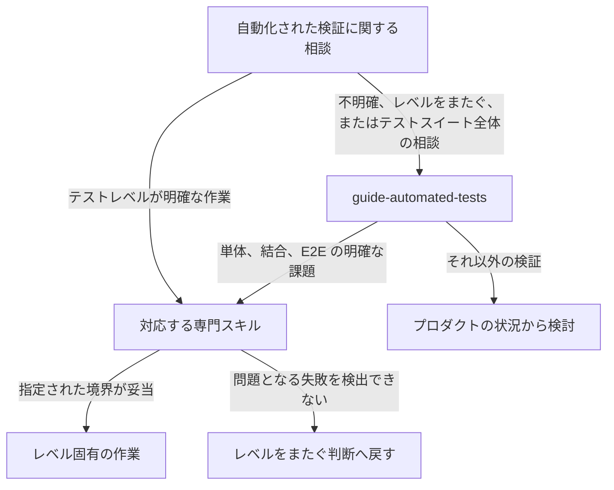

# テストスキルの構成

## 目的

テストに関する指針を次の二つに分ける。

- レベルをまたぐ戦略：問題となるリスク、必要な根拠、その根拠を得るための検証方法
- レベル固有の実践：単体テスト、結合テスト、E2E テストの設計、実装、レビュー

この分離により、共通戦略を一か所で管理しながら、各テストレベルに固有の依頼が常に上位スキルを経由する構造を避ける。

## スキル

`guide-automated-tests` は、レベルをまたぐ判断や、答えが明らかでない判断を扱う。
適切な検証方法が不明な場合、複数のレベルにまたがる場合、指定されたテストレベルで問題となる仕組みを確認できない場合、またはテストスイート全体を分析する場合に使う。
単体、結合、E2E のいずれかに明確に該当する課題は専門スキルへ委ね、それ以外は上位スキルで扱う。

単独で利用できる専門スキルは次の三つである。

- `guide-unit-tests`：単体テストの境界、ケース、アサーション、テストダブル、実装、レビュー
- `guide-integration-tests`：実際の連携、インフラに固有の性質、制御されたプロセス外の依存関係、実装、レビュー
- `guide-e2e-tests`：外部から操作する代表的な一連の振る舞い、環境、安定性、実装、レビュー

各専門スキルは、ユーザーからの明確な依頼または上位スキルが作成した課題を起点にできる。
指定された境界に問題となる仕組みが含まれるかを確認し、含まれない場合は残る問題を説明して、レベルをまたぐ判断を依頼元へ戻す。

## 利用時の流れ

上位スキルと専門スキルのどちらからでも作業を始められる。

専門スキルへ委ねる際に、テスト戦略の検討を最初からやり直さない。
上位スキルがテスト課題を渡し、専門スキルが同じタスクの状況に対して、各テストレベルに固有の指針を適用する。
直接依頼された場合は、専門スキルが担当範囲に限って境界を確認する。

## パッケージの依存関係

`guide-automated-tests` のパッケージは三つの専門スキルへ依存するため、インストールすると一連のスキルを利用できる。
各専門スキルは単独でもインストールでき、上位スキルへの逆向きの依存は定義しない。
この一方向の関係により、直接利用を支えながら循環依存を避ける。

## 共通のテスト課題

実行時の引き継ぎ契約は `references-ja/guidance.md` だけで定義する。
上位スキルは、専門スキルへ委ねる前にこの契約に従って課題を作る。
専門スキルは受け取った情報を使い、契約を複製したり定義し直したりしない。

## 拡張

単体テスト、結合テスト、E2E テストは、エントリーポイント、含める範囲、依存関係の再現度、配置方法、観測する結果、運用コストを組み合わせた代表的な区分であり、完全な分類ではない。

設計、実装、レビューに固有かつ繰り返し使う指針がある場合だけ、専門スキルを追加する。
一時的な検証方法を分類するためだけに専門スキルを追加しない。

設計上の責務はこの文書、出典の判断理由は各スキルの `maintenance/sources.md`、引き継ぎ契約は上位スキルの `references-ja/guidance.md`、各レベルの実行時の指針はそれぞれの専門スキルで管理する。
