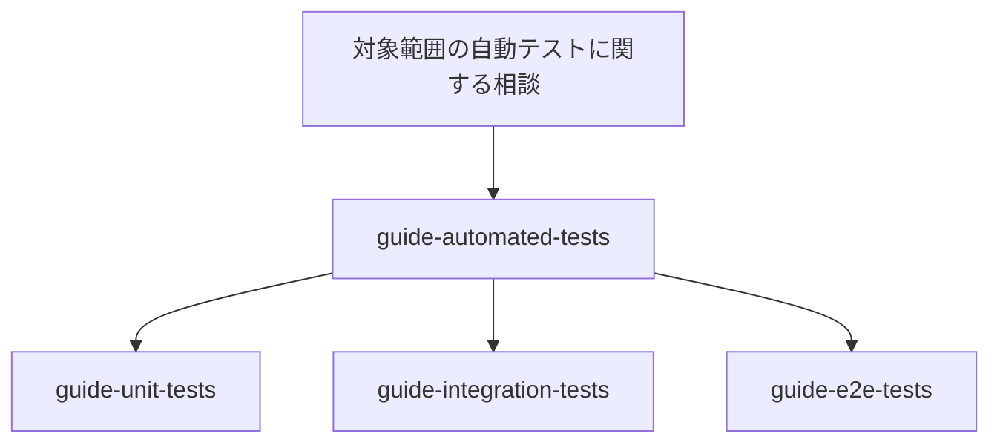

# テストスキルの構成

## 目的

テストに関する指針を次の二つに分ける。

- 共通戦略：テストする理由、問題となるリスク、責務を持たせる境界
- レベル固有の実践：単体テスト、結合テスト、E2E テストへ割り当てられた責務の設計、実装、レビュー

この分離により、共通思想を一か所で管理しながら、上位スキルへすべてのテスト種別の詳細を詰め込まずに済む。

## スキル

`guide-automated-tests` は上位スキルである。
単体テスト、結合テスト、E2E テストのいずれかに限定された依頼も含め、このスキル群が扱う自動テストの相談は上位スキルから始める。
各テストレベルの一般的なプラクティスを参照し、プロダクトの振る舞い、プロダクションコード、依存関係、既存のテスト、制約、過去の障害を確認する。
その上で、問題となる失敗を検出でき、実行コストと保守コストに見合うテスト戦略をユーザーと組み立て、具体的な課題を専門スキルへ委ねる。

専門スキルは次の三つである。

- `guide-unit-tests`：高速で結果が決定的な振る舞いの境界と、単体テスト固有の設計
- `guide-integration-tests`：実際の連携、インフラに固有の性質、制御されたプロセス外の依存関係
- `guide-e2e-tests`：プロジェクトが定める E2E テストの境界を外部から通す代表的な一連の振る舞い

各専門スキルは、割り当てられた境界に問題となる仕組みが残っているか確認する。
含められない場合は、残る問題を説明し、テストレベル間の判断を上位スキルへ戻す。

## 利用時の流れ

このスキル群が扱う自動テストの相談は上位スキルから始める。

指定されたテストレベルで問題となる失敗を検出できる場合は、上位スキルが振る舞い、リスク、境界を簡潔に確認する。
その後、テストスイート全体の分析を強制せず、専門スキルへ課題を委ねる。

専門スキルへ委ねる際に、テスト戦略の検討を最初からやり直さない。
上位スキルがテスト課題を整理し、専門スキルが同じタスクの状況に対して、各テストレベルに固有の指針を適用する。

## パッケージの依存関係

`guide-automated-tests` のパッケージは三つの専門スキルへ依存するため、インストールするとすべての専門スキルを利用できる。
専門スキルのパッケージから上位スキルへの逆向きの依存は定義しない。
利用時の流れに合わせて依存方向を一方向に保ち、循環依存を避ける。

## 共通のテスト課題

上位スキルから次を渡す。

- 振る舞いと失敗リスク
- 選んだ境界と理由
- エントリーポイントと含める範囲
- 依存関係の扱い
- 観測する結果
- 必要なシナリオ
- 実行と保守の制約
- 別の検証手段へ割り当てたリスク

専門スキルは、その課題を各レベルで実装、レビューするために必要な規則だけを扱う。
境界の確認は簡潔に繰り返してよいが、テストの目的、共通の評価軸、カバレッジ方針、テストスイートの構成を定義し直さない。

## 拡張

単体テスト、結合テスト、E2E テストは、エントリーポイント、含める範囲、依存関係の再現度、配置方法、観測する結果、運用コストを組み合わせた代表的な区分であり、完全な分類ではない。

設計、実装、レビューに固有かつ繰り返し使う指針がある場合だけ、専門スキルを追加する。
フレームワークやテスト対象などによって必要な資料を選択できる場合だけ、実行時の参照資料を追加する。

設計上の責務はこの文書、出典の判断理由は各スキルの `maintenance/sources.md`、実行時の指針は各 `SKILL.md` と一つの汎用的な参照資料で管理する。
