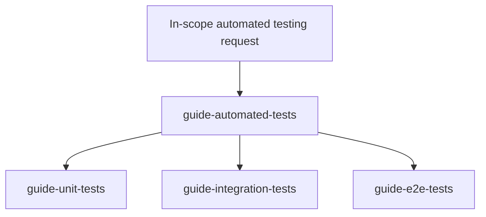

# Test Skill Architecture

## Purpose

Testing guidance is split between:

- shared strategy: why to test, which risk matters, and which boundary should carry it
- level-specific practice: how to design, implement, and review an assigned unit, integration, or E2E responsibility

This separation keeps the shared philosophy in one place without turning the head skill into a handbook for every test type.

## Skills

`guide-automated-tests` is the head skill.
Every automated testing request covered by this skill family starts here, including a request already framed as unit, integration, or E2E work.
It applies general practices across test levels and inspects product behavior, production code, dependencies, existing tests, constraints, and failure history.
It then builds a strategy with the user that can detect the relevant failures at an acceptable execution and maintenance cost, and delegates concrete assignments.

The specialists are:

- `guide-unit-tests`: fast, deterministic behavior boundaries and unit-test-specific design
- `guide-integration-tests`: real collaboration, infrastructure semantics, and controlled process-external dependencies
- `guide-e2e-tests`: representative externally driven journeys through the project's E2E boundary

Each specialist confirms that its assigned boundary still contains the mechanism at risk.
If not, it explains the gap and returns the cross-level decision to the head skill.

## Interaction Flow

Every in-scope automated testing request enters through the head skill:

When the requested test level exercises the mechanism needed to detect the relevant failure, the head confirms the behavior, risk, and boundary briefly.
It then delegates the assignment without forcing a full portfolio analysis.

Delegation does not restart strategy design.
The head supplies a test assignment, and the specialist applies its level-specific guidance to the same task context.

## Package Dependencies

The `guide-automated-tests` package depends on all three specialists, so installing it makes them available.
Specialist packages do not declare a reverse dependency on the head.
This one-way relationship follows the interaction flow and avoids a dependency cycle.

## Shared Decision Contract

The head passes:

- behavior and failure risk
- selected boundary and reason
- entry point and included scope
- dependency treatment
- observable result
- required scenarios
- execution and maintenance constraints
- risks assigned elsewhere

Specialists own only the rules needed to implement and review that assignment at their level.
They may repeat a short boundary check, but do not redefine testing purpose, quality criteria, coverage policy, or portfolio shape.

## Extension

Unit, integration, and E2E are useful profiles over entry point, included scope, dependency fidelity, deployment arrangement, observation, and operating cost.
They are not an exhaustive taxonomy.

Add another specialist only when it has distinct recurring design, implementation, and review guidance.
Add another runtime reference only when agents can select it conditionally, such as for a framework or test domain.

Keep design ownership here, source rationale in each skill's `maintenance/sources.md`, and runtime guidance in each `SKILL.md` and its single general reference.
