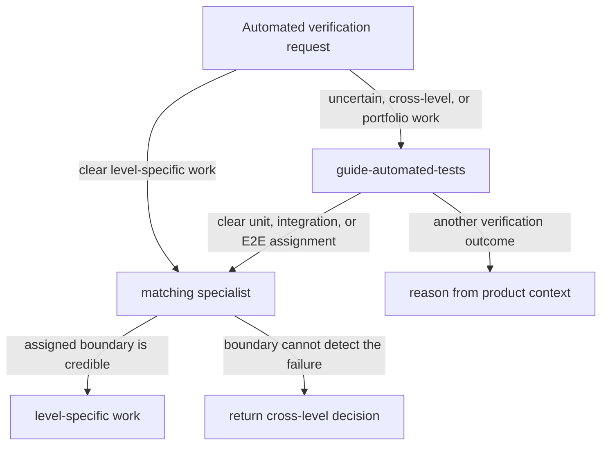

# Test Skill Architecture

## Purpose

Testing guidance is split between:

- cross-level strategy: which risk matters, what evidence is needed, and which verification approach should provide it
- level-specific practice: how to design, implement, and review unit, integration, or E2E work

This separation keeps shared strategy in one place without making every level-specific request pass through the head skill.

## Skills

`guide-automated-tests` handles cross-level or uncertain decisions.
Use it when the appropriate verification approach is unclear, the work spans levels, the requested level may not exercise the mechanism at risk, or the user wants portfolio analysis.
It may delegate a clear unit, integration, or E2E assignment or handle another outcome directly.

The standalone specialists are:

- `guide-unit-tests`: unit-test boundaries, cases, assertions, test doubles, implementation, and review
- `guide-integration-tests`: real collaboration, infrastructure semantics, controlled process-external dependencies, implementation, and review
- `guide-e2e-tests`: representative externally driven journeys, environments, reliability, implementation, and review

Each specialist can start from a clear user request or an assignment from the head skill.
It confirms that its boundary still contains the mechanism at risk.
If not, it explains the gap and returns the cross-level decision to the caller.

## Interaction Flow

Requests can enter through the head or a specialist:

Delegation does not restart strategy design.
The head supplies a test assignment, and the specialist applies its level-specific guidance to the same task context.
A direct request requires only the specialist's scoped boundary check.

## Package Dependencies

The `guide-automated-tests` package depends on all three specialists, so installing it provides the complete workflow.
Specialist packages remain independently installable and do not declare a reverse dependency on the head.
This one-way relationship avoids a dependency cycle while supporting direct specialist use.

## Shared Decision Contract

The runtime handoff contract is defined only in `references/guidance.md`.
The head creates that assignment before delegation.
Specialists consume the supplied context without copying or redefining the contract.

## Extension

Unit, integration, and E2E are useful profiles over entry point, included scope, dependency fidelity, deployment arrangement, observation, and operating cost.
They are not an exhaustive taxonomy.

Add another specialist only when it has distinct recurring design, implementation, and review guidance.
Do not add a specialist only to classify an occasional verification approach.

Keep architecture ownership here, source rationale in each skill's `maintenance/sources.md`, the handoff contract in the head skill's `references/guidance.md`, and runtime level-specific guidance in each specialist.
